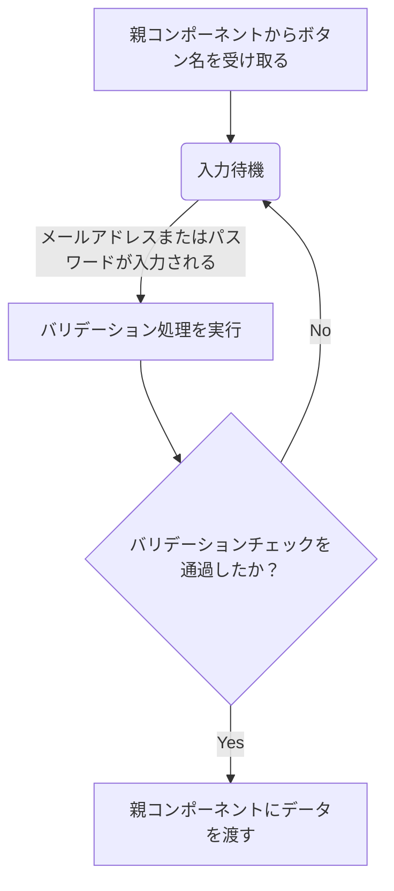

## イメージ
下記画像の入力項目部分のコンポーネントを作成します
- 入力項目：メールアドレス
- 入力項目：パスワード
- ボタン：親にデータを渡すボタン


## 仕様
この入力コンポーネントは「ログイン画面」と「サインアップ」画面で同一のものを使うことを想定として作成します。

### バリデーション
**メールアドレス**
- 必須項目であること
- 最低限メールアドレスの形式であること
```js
const emailRules = [
  (v: string) => !!v || 'メールアドレスは必須です',
  (v: string) => /.+@.+\..+/.test(v) || 'メールアドレスが不正です',
]
```
**パスワード**
特に入力のバリデーションは設けないとする
- 必須項目であること

```js
const passwordRules = [(v: string) => !!v || 'パスワードは必須です']
```

### コンポーネント内の処理の流れ
1.「親にデータを渡すボタン」の名前を親から受け取る
2. 入力項目に値が入力されるとバリデーションの処理が行われる
3. 「メールアドレス」と「パスワード」のバリデーションチェックを通過すると親にデータを渡す



### UI
Vuetifyを活用
https://vuetifyjs.com/en/components/text-fields/#password-input

### ソースコード
```vue
<template>
  <v-form ref="form" @submit.prevent="submit">
    <v-text-field
      v-model="email"
      color="primary"
      variant="underlined"
      label="メールアドレス"
      :rules="emailRules"
      autocomplete="email"
    />
    <v-text-field
      v-model="password"
      :append-icon="show2 ? 'mdi-eye' : 'mdi-eye-off'"
      :rules="passwordRules"
      :type="show2 ? 'text' : 'password'"
      label="パスワード"
      variant="underlined"
      autocomplete="current-password"
      @click:append="show2 = !show2"
    ></v-text-field>
    <v-btn color="primary" class="mt-4" type="submit" block>{{
      btnLabel
    }}</v-btn>
  </v-form>
</template>

<script setup lang="ts">
defineProps<{
  btnLabel: string
}>()

const email = ref('')
const password = ref('')
const show2 = ref(false)
const form = ref()

const emailRules = [
  (v: string) => !!v || 'メールアドレスは必須です',
  (v: string) => /.+@.+\..+/.test(v) || 'メールアドレスが不正です',
]
const passwordRules = [(v: string) => !!v || 'パスワードは必須です']

const emit = defineEmits(['submit'])

const submit = async () => {
  if (form.value) {
    const { valid } = await form.value.validate()
    if (!valid) return
    emit('submit', { email: email.value, password: password.value })
  }
}
</script>

```

### GitHubのコミット
https://github.com/nakajima-sh-cnctor/nuxt4-firebase-chat/commit/c5cd1385f95301bddeafa06a9606e1a641df4b3f