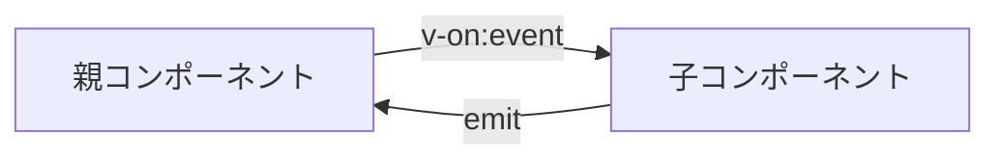

# はじめに

Vue3のコンポーネント間通信において、イベントシステムは非常に重要な役割を果たします。この記事では、Vue3のイベントシステムについて、基本的な使い方から高度なパターンまで詳しく解説します。

## この記事で学べること

- Vue3のイベントシステムの基本概念
- `emit`と`v-on`を使った親子コンポーネント間の通信
- カスタムイベントの作成と活用方法
- イベントの型安全性の確保
- 実用的なパターンとベストプラクティス

## Vue3のイベントシステム概要

Vue3では、コンポーネント間の通信を実現するために、以下のイベント関連の機能が提供されています：

- **`emit`**: 子コンポーネントから親コンポーネントにイベントを送信
- **`v-on`**: イベントリスナーを設定
- **カスタムイベント**: 独自のイベントを作成
- **イベント修飾子**: イベントの動作を制御

## 基本的なイベントの流れ



1. 親コンポーネントが子コンポーネントに`v-on`でイベントリスナーを設定
2. 子コンポーネントが`emit`でイベントを発火
3. 親コンポーネントがイベントを受け取り、処理を実行

## 基本的なemitとv-onの使い方

### 子コンポーネント（イベントを発火）

```vue:components/ChildComponent.vue
<script setup lang="ts">
// イベントの定義
const emit = defineEmits<{
  // イベント名: [引数の型]
  buttonClick: [message: string]
  formSubmit: [data: { name: string; email: string }]
}>()

// ボタンクリック時の処理
const handleButtonClick = () => {
  emit('buttonClick', 'ボタンがクリックされました！')
}

// フォーム送信時の処理
const handleFormSubmit = (formData: { name: string; email: string }) => {
  emit('formSubmit', formData)
}
</script>

<template>
  <div>
    <button @click="handleButtonClick">
      クリックしてください
    </button>
    
    <form @submit.prevent="handleFormSubmit({ name: '田中太郎', email: 'tanaka@example.com' })">
      <button type="submit">送信</button>
    </form>
  </div>
</template>
```

### 親コンポーネント（イベントを受け取り）

```vue:components/ParentComponent.vue
<script setup lang="ts">
// イベントハンドラー
const handleButtonClick = (message: string) => {
  console.log('子コンポーネントからのメッセージ:', message)
  alert(message)
}

const handleFormSubmit = (data: { name: string; email: string }) => {
  console.log('フォームデータ:', data)
  // データベースに保存などの処理
}
</script>

<template>
  <div>
    <h1>親コンポーネント</h1>
    <!-- 子コンポーネントにイベントリスナーを設定 -->
    <ChildComponent 
      @button-click="handleButtonClick"
      @form-submit="handleFormSubmit"
    />
  </div>
</template>
```

## 型安全なイベント定義

TypeScriptを使用する場合、イベントの型安全性を確保することが重要です。

### 方法1: 配列形式での型定義

```typescript
const emit = defineEmits<{
  // イベント名: [引数1の型, 引数2の型, ...]
  userLogin: [userId: string, timestamp: Date]
  dataUpdate: [id: number, data: Record<string, any>]
  error: [error: Error]
}>()
```

### 方法2: オブジェクト形式での型定義

```typescript
const emit = defineEmits<{
  userLogin: (userId: string, timestamp: Date) => void
  dataUpdate: (id: number, data: Record<string, any>) => void
  error: (error: Error) => void
}>()
```

### 方法3: インターフェースを使用した型定義

```typescript
interface EmitEvents {
  userLogin: (userId: string, timestamp: Date) => void
  dataUpdate: (id: number, data: Record<string, any>) => void
  error: (error: Error) => void
}

const emit = defineEmits<EmitEvents>()
```

## 実用的なパターン

### 1. フォームコンポーネントでのイベント活用

```vue:components/UserForm.vue
<script setup lang="ts">
interface UserData {
  name: string
  email: string
  age: number
}

const emit = defineEmits<{
  submit: [data: UserData]
  cancel: []
  validationError: [errors: string[]]
}>()

const formData = ref<UserData>({
  name: '',
  email: '',
  age: 0
})

const validateForm = (): string[] => {
  const errors: string[] = []
  
  if (!formData.value.name.trim()) {
    errors.push('名前は必須です')
  }
  
  if (!formData.value.email.includes('@')) {
    errors.push('有効なメールアドレスを入力してください')
  }
  
  if (formData.value.age < 0 || formData.value.age > 150) {
    errors.push('年齢は0〜150の範囲で入力してください')
  }
  
  return errors
}

const handleSubmit = () => {
  const errors = validateForm()
  
  if (errors.length > 0) {
    emit('validationError', errors)
    return
  }
  
  emit('submit', { ...formData.value })
}

const handleCancel = () => {
  emit('cancel')
}
</script>

<template>
  <form @submit.prevent="handleSubmit">
    <input 
      v-model="formData.name" 
      type="text" 
      placeholder="名前"
    />
    <input 
      v-model="formData.email" 
      type="email" 
      placeholder="メールアドレス"
    />
    <input 
      v-model.number="formData.age" 
      type="number" 
      placeholder="年齢"
    />
    
    <div>
      <button type="submit">送信</button>
      <button type="button" @click="handleCancel">キャンセル</button>
    </div>
  </form>
</template>
```

### 2. モーダルコンポーネントでのイベント活用

```vue:components/Modal.vue
<script setup lang="ts">
interface Props {
  isOpen: boolean
  title: string
}

const props = defineProps<Props>()

const emit = defineEmits<{
  close: []
  confirm: [data?: any]
}>()

const handleClose = () => {
  emit('close')
}

const handleConfirm = () => {
  emit('confirm')
}

// ESCキーでモーダルを閉じる
const handleKeydown = (event: KeyboardEvent) => {
  if (event.key === 'Escape') {
    handleClose()
  }
}

onMounted(() => {
  document.addEventListener('keydown', handleKeydown)
})

onUnmounted(() => {
  document.removeEventListener('keydown', handleKeydown)
})
</script>

<template>
  <Teleport to="body">
    <div v-if="isOpen" class="modal-overlay" @click="handleClose">
      <div class="modal-content" @click.stop>
        <div class="modal-header">
          <h2>{{ title }}</h2>
          <button @click="handleClose" class="close-button">×</button>
        </div>
        
        <div class="modal-body">
          <slot />
        </div>
        
        <div class="modal-footer">
          <button @click="handleClose">キャンセル</button>
          <button @click="handleConfirm">確認</button>
        </div>
      </div>
    </div>
  </Teleport>
</template>
```

### 3. リストコンポーネントでのイベント活用

```vue:components/TodoList.vue
<script setup lang="ts">
interface Todo {
  id: number
  text: string
  completed: boolean
}

const emit = defineEmits<{
  addTodo: [text: string]
  toggleTodo: [id: number]
  deleteTodo: [id: number]
  editTodo: [id: number, newText: string]
}>()

const newTodoText = ref('')

const handleAddTodo = () => {
  if (newTodoText.value.trim()) {
    emit('addTodo', newTodoText.value.trim())
    newTodoText.value = ''
  }
}

const handleToggleTodo = (id: number) => {
  emit('toggleTodo', id)
}

const handleDeleteTodo = (id: number) => {
  emit('deleteTodo', id)
}

const handleEditTodo = (id: number, newText: string) => {
  emit('editTodo', id, newText)
}
</script>

<template>
  <div class="todo-list">
    <div class="add-todo">
      <input 
        v-model="newTodoText"
        @keyup.enter="handleAddTodo"
        placeholder="新しいタスクを入力"
      />
      <button @click="handleAddTodo">追加</button>
    </div>
    
    <div class="todo-items">
      <slot 
        :todos="todos"
        :onToggle="handleToggleTodo"
        :onDelete="handleDeleteTodo"
        :onEdit="handleEditTodo"
      />
    </div>
  </div>
</template>
```

## イベント修飾子の活用

Vue3では、イベントの動作を制御するための修飾子が提供されています。

### 基本的な修飾子

```vue
<template>
  <!-- イベントの伝播を停止 -->
  <button @click.stop="handleClick">クリック</button>
  
  <!-- デフォルトの動作を防止 -->
  <form @submit.prevent="handleSubmit">フォーム</form>
  
  <!-- 修飾子のチェーン -->
  <a @click.stop.prevent="handleLinkClick">リンク</a>
  
  <!-- 一度だけ実行 -->
  <button @click.once="handleClick">一度だけ</button>
  
  <!-- 左クリックのみ -->
  <div @click.left="handleLeftClick">左クリック</div>
  
  <!-- 右クリックのみ -->
  <div @click.right="handleRightClick">右クリック</div>
  
  <!-- 中クリックのみ -->
  <div @click.middle="handleMiddleClick">中クリック</div>
</template>
```

### キー修飾子

```vue
<template>
  <!-- Enterキー -->
  <input @keyup.enter="handleEnter" />
  
  <!-- Escapeキー -->
  <input @keyup.escape="handleEscape" />
  
  <!-- 特定のキー -->
  <input @keyup.space="handleSpace" />
  
  <!-- キーの組み合わせ -->
  <input @keyup.ctrl.enter="handleCtrlEnter" />
  
  <!-- カスタムキーコード -->
  <input @keyup.13="handleEnter" />
</template>
```

## 高度なパターン

### 1. イベントバスパターン（非推奨だが理解のために）

```typescript
// イベントバス（Vue3では非推奨）
import { createApp } from 'vue'

const app = createApp({})
const eventBus = app.config.globalProperties.$eventBus = new EventTarget()

// イベントの発火
eventBus.dispatchEvent(new CustomEvent('user-login', { 
  detail: { userId: '123' } 
}))

// イベントの監視
eventBus.addEventListener('user-login', (event) => {
  console.log('ユーザーログイン:', event.detail)
})
```

### 2. Provide/Injectパターンでのイベント共有

```vue:components/EventProvider.vue
<script setup lang="ts">
import { provide, ref } from 'vue'

// イベントハンドラーの型定義
interface EventHandlers {
  onUserLogin: (userId: string) => void
  onUserLogout: () => void
}

const eventHandlers = ref<EventHandlers>({
  onUserLogin: () => {},
  onUserLogout: () => {}
})

// イベントハンドラーの登録
const registerEventHandler = <K extends keyof EventHandlers>(
  event: K,
  handler: EventHandlers[K]
) => {
  eventHandlers.value[event] = handler
}

// イベントの発火
const emitEvent = <K extends keyof EventHandlers>(
  event: K,
  ...args: Parameters<EventHandlers[K]>
) => {
  const handler = eventHandlers.value[event]
  if (handler) {
    handler(...args)
  }
}

// 子コンポーネントに提供
provide('eventHandlers', {
  register: registerEventHandler,
  emit: emitEvent
})
</script>

<template>
  <slot />
</template>
```

### 3. Composableを使ったイベント管理

```typescript:composables/useEventBus.ts
import { ref, onUnmounted } from 'vue'

type EventCallback = (...args: any[]) => void

class EventBus {
  private events: Map<string, EventCallback[]> = new Map()

  on(event: string, callback: EventCallback) {
    if (!this.events.has(event)) {
      this.events.set(event, [])
    }
    this.events.get(event)!.push(callback)
  }

  off(event: string, callback: EventCallback) {
    const callbacks = this.events.get(event)
    if (callbacks) {
      const index = callbacks.indexOf(callback)
      if (index > -1) {
        callbacks.splice(index, 1)
      }
    }
  }

  emit(event: string, ...args: any[]) {
    const callbacks = this.events.get(event)
    if (callbacks) {
      callbacks.forEach(callback => callback(...args))
    }
  }
}

const eventBus = new EventBus()

export const useEventBus = () => {
  const on = (event: string, callback: EventCallback) => {
    eventBus.on(event, callback)
    
    // コンポーネントのアンマウント時に自動的にイベントリスナーを削除
    onUnmounted(() => {
      eventBus.off(event, callback)
    })
  }

  const emit = (event: string, ...args: any[]) => {
    eventBus.emit(event, ...args)
  }

  return {
    on,
    emit
  }
}
```

## ベストプラクティス

### 1. イベント名の命名規則

```typescript
// 良い例：動詞 + 名詞の形式
const emit = defineEmits<{
  userLogin: [userId: string]
  dataUpdate: [data: any]
  formSubmit: [formData: FormData]
  modalClose: []
}>()

// 悪い例：曖昧な命名
const emit = defineEmits<{
  click: []
  data: [data: any]
  action: [type: string]
}>()
```

### 2. 型安全性の確保

```typescript
// 良い例：厳密な型定義
interface UserLoginEvent {
  userId: string
  timestamp: Date
  userAgent: string
}

const emit = defineEmits<{
  userLogin: [event: UserLoginEvent]
}>()

// 悪い例：any型の使用
const emit = defineEmits<{
  userLogin: [data: any]
}>()
```

### 3. イベントハンドラーの適切な処理

```typescript
// 良い例：エラーハンドリングを含む
const handleUserLogin = async (userId: string) => {
  try {
    loading.value = true
    await loginUser(userId)
    emit('loginSuccess', userId)
  } catch (error) {
    emit('loginError', error)
  } finally {
    loading.value = false
  }
}

// 悪い例：エラーハンドリングなし
const handleUserLogin = (userId: string) => {
  loginUser(userId) // エラーが発生する可能性がある
  emit('loginSuccess', userId)
}
```

### 4. メモリリークの防止

```typescript
// 良い例：適切なクリーンアップ
onMounted(() => {
  const handleResize = () => {
    // リサイズ処理
  }
  
  window.addEventListener('resize', handleResize)
  
  onUnmounted(() => {
    window.removeEventListener('resize', handleResize)
  })
})

// 悪い例：クリーンアップなし
onMounted(() => {
  window.addEventListener('resize', () => {
    // リサイズ処理
  })
  // イベントリスナーが削除されない
})
```

## よくある問題と解決方法

### 1. イベントが発火しない

```typescript
// 問題：イベント名の不一致
// 子コンポーネント
emit('buttonClick', 'メッセージ')

// 親コンポーネント
<ChildComponent @button-click="handleClick" /> // ケバブケース

// 解決方法：イベント名を統一
emit('button-click', 'メッセージ')
<ChildComponent @button-click="handleClick" />
```

### 2. 型エラーが発生する

```typescript
// 問題：型定義の不一致
const emit = defineEmits<{
  userLogin: [userId: string]
}>()

// 間違った引数の型
emit('userLogin', 123) // エラー：number型を渡している

// 解決方法：正しい型を渡す
emit('userLogin', '123')
```

### 3. イベントリスナーが重複する

```typescript
// 問題：同じイベントリスナーが複数回登録される
onMounted(() => {
  window.addEventListener('resize', handleResize)
  window.addEventListener('resize', handleResize) // 重複
})

// 解決方法：一度だけ登録する
onMounted(() => {
  window.addEventListener('resize', handleResize)
})
```

## まとめ

Vue3のイベントシステムは、コンポーネント間の通信を実現するための強力な機能です。適切に使用することで、保守性が高く、型安全なアプリケーションを構築できます。

### 重要なポイント

1. **型安全性**: TypeScriptを使用してイベントの型を厳密に定義する
2. **命名規則**: 一貫性のあるイベント名を使用する
3. **エラーハンドリング**: イベントハンドラーで適切なエラー処理を実装する
4. **メモリ管理**: 不要なイベントリスナーを適切に削除する
5. **パフォーマンス**: 必要に応じてイベントの最適化を行う

### 今後の学習

- Vue3のComposition APIの詳細
- 状態管理ライブラリ（Pinia）との連携
- カスタムディレクティブの作成
- プラグイン開発

この記事で学んだ内容を活用して、より高度なVue3アプリケーションを構築してください！