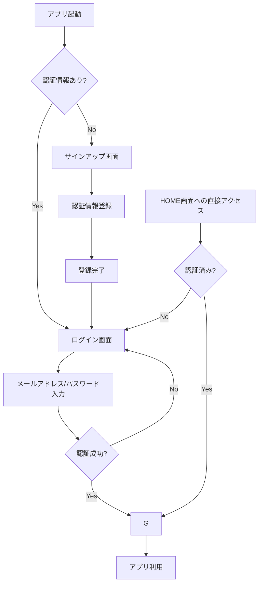

## 関連記事
https://zenn.dev/shunsuke_stack/articles/3b7759f0053ca6

https://zenn.dev/shunsuke_stack/articles/bdf5b784bd6f8b

https://zenn.dev/shunsuke_stack/articles/88dedd7c5a2341

## 認証フロー


## HOME画面の閲覧制限を実装
認証情報がないとHOME画面(index.vue)を開けないように制限を設けます。

### middlewareでは実装しない
一般的な方法としては middlewareで実装する手がありますが、今回の実装ではapp/composables/useAuth.tsで認証状態の監視を行っているのでわざわざ経由する必要がありません

###　firebase/auth onAuthStateChangedの仕様

`firebase/auth` の `onAuthStateChanged` は、ユーザーのログイン状態（サインイン、サインアウト、またはトークンの有効期限切れなど）の変化を監視するための非常に重要な機能です。これは、アプリケーションの表示をユーザーの認証状態に応じて動的に変更したい場合に中心的な役割を果たします。

-----

## `onAuthStateChanged` の基本的な仕組み

`onAuthStateChanged` は、Firebase Authenticationの状態に変化があったときに常に呼び出される「オブザーバー（監視者）」を設定するメソッドです。ページが読み込まれたとき、ユーザーがログインしたとき、またはログアウトしたときにトリガーされます。

このメソッドは、引数としてコールバック関数を受け取ります。そのコールバック関数には、現在のユーザー情報が含まれる `user` オブジェクトが渡されます。

  * **ユーザーがサインインしている場合**: `user` オブジェクトには、`uid`, `displayName`, `email` などのユーザー情報が含まれます。
  * **ユーザーがサインアウトしている場合**: `user` オブジェクトは `null` になります。

### 主な特徴

  * **持続的な状態管理**: Firebase SDKは、ユーザーの認証状態を自動的に永続化します（通常はIndexedDBに保存）。これにより、ユーザーがブラウザを閉じたり、ページを再読み込みしたりしても、ログイン状態が維持されます。`onAuthStateChanged` は、この永続化された状態を読み込んで通知してくれます。
  * **リアルタイムな監視**: ユーザーのログイン/ログアウト操作を即座に検知し、アプリケーションのUIをリアルタイムで更新できます。
  * **初期化時の呼び出し**: アプリケーションの読み込み時に一度必ず呼び出されます。これにより、ユーザーが既にログインしているかどうかを確認し、適切な画面（例：ホームページまたはログインページ）にリダイレクトできます。

-----

## 実装方法

`onAuthStateChanged` を使用するには、まずFirebase Authのインスタンスを取得し、そのインスタンスに対してリスナーを登録します。

### 基本的なコード例 (JavaScript)

```javascript
import { getAuth, onAuthStateChanged } from "firebase/auth";

// Firebase Authのインスタンスを取得
const auth = getAuth();

// 認証状態の変化を監視するリスナーを登録
const unsubscribe = onAuthStateChanged(auth, (user) => {
  if (user) {
    // ユーザーがログインしている場合の処理
    console.log("ユーザーはログインしています:", user);
    const uid = user.uid;
    // 例: ユーザー専用ページにリダイレクトする
    // window.location.href = '/dashboard';
  } else {
    // ユーザーがログアウトしている場合の処理
    console.log("ユーザーはログアウトしています。");
    // 例: ログインページにリダイレクトする
    // window.location.href = '/login';
  }
});

// 必要に応じてリスナーを解除する
// unsubscribe();
```

### ポイント

1.  **`getAuth()`**: FirebaseアプリのAuthサービスインスタンスを取得します。
2.  **`onAuthStateChanged(auth, callback)`**: 第一引数に`auth`インスタンス、第二引数に状態変化時に実行したいコールバック関数を渡します。
3.  **`user` オブジェクト**: コールバック関数に渡されるこのオブジェクトで、ログイン状態を判定します。
4.  **`unsubscribe`**: `onAuthStateChanged` は、監視を停止するための関数（この例では `unsubscribe`）を返します。コンポーネントがアンマウントされる際など、監視が不要になった場合は、この関数を呼び出してメモリリークを防ぐことが推奨されます（特にReactやVueなどのフレームワークで重要です）。

-----

### なぜ `currentUser` よりも `onAuthStateChanged` を使うべきか？

`auth.currentUser` プロパティを使っても、現在のユーザー情報を取得できます。しかし、これには一つ大きな注意点があります。

Firebase SDKが初期化され、永続化された認証情報を非同期で読み込んでいる間、`auth.currentUser` は `null` になります。そのため、ページの読み込み直後に `auth.currentUser` を参照すると、ユーザーが実際にはログインしているにもかかわらず `null` が返ってきてしまう可能性があります。

一方で、**`onAuthStateChanged` は、この初期化プロセスが完了してからコールバック関数を実行することを保証します。** そのため、アプリケーションの読み込み時にユーザーのログイン状態を確実に把握するためには、`auth.currentUser` ではなく `onAuthStateChanged` を使用するのがベストプラクティスです。

-----

## 実装
`app/composables/useAuth.ts`の使用時に`onMounted`でフックし`onAuthStateChanged`でFirebase Authの状態変更を監視

```ts:app/composables/useAuth.ts
...中略
// 認証状態の監視
onMounted(() => {
// Firebase Authが初期化されていない場合は処理を終了
if (!auth) {
    loading.value = false
    return
}

// Firebase Authの状態変更を監視するリスナーを設定
// ユーザーのログイン・ログアウト状態が変更されるたびに実行される
const unsubscribe = onAuthStateChanged(auth, (currentUser) => {
    // ユーザーが未認証の場合、ログインページにリダイレクト
    if (!currentUser) {
        navigateTo('/login')
    }
    // 現在のユーザー情報をリアクティブな変数に保存
    user.value = currentUser
    // ローディング状態を解除
    loading.value = false
})

// コンポーネントがアンマウントされる際にリスナーを解除
// メモリリークを防ぐためのクリーンアップ処理
onUnmounted(() => unsubscribe())
})
...中略
```

### HOME画面の実装

```:ディレクトリ構造
app/
├── pages/
│   ├── home/
│   │   └── index.vue
│   └── home.vue
```

```vue:app/pages/home.vue
<template>
  <div>
    <!-- ローディング状態 -->
    <div v-if="loading" class="loading">
      <v-progress-circular
        indeterminate
        color="primary"
        size="64"
      ></v-progress-circular>
      <p class="mt-4">認証状態を確認中...</p>
    </div>
    <div v-else>
      <NuxtPage />
    </div>
  </div>
</template>

<script setup lang="ts">
const { loading } = useAuth()
</script>

<style scoped>
.loading {
  text-align: center;
  padding: 4rem 0;
}
</style>
```

HOMEディレクトリ内は認証による閲覧制限を設ける為、ルートの親ファイルで認証確認の処理を実装

```vue:app/pages/home/index.vue
<template>
  <!-- 認証済みユーザー -->
  <v-card class="mx-auto" max-width="600">
    <v-card-item>
      <v-card-title class="text-center">
        ようこそ、{{ user?.email }}さん！
      </v-card-title>
      <v-card-subtitle class="text-center">
        ログイン認証が完了しました
      </v-card-subtitle>
    </v-card-item>

    <v-card-text>
      <v-alert
        v-if="error"
        type="error"
        :text="error"
        variant="tonal"
        class="mb-4"
      ></v-alert>

      <div class="user-info">
        <v-list>
          <v-list-item>
            <template #prepend>
              <v-icon>mdi-email</v-icon>
            </template>
            <v-list-item-title>メールアドレス</v-list-item-title>
            <v-list-item-subtitle>{{ user?.email }}</v-list-item-subtitle>
          </v-list-item>

          <v-list-item>
            <template #prepend>
              <v-icon>mdi-account</v-icon>
            </template>
            <v-list-item-title>ユーザーID</v-list-item-title>
            <v-list-item-subtitle>{{ user?.uid }}</v-list-item-subtitle>
          </v-list-item>

          <v-list-item>
            <template #prepend>
              <v-icon>mdi-calendar</v-icon>
            </template>
            <v-list-item-title>アカウント作成日</v-list-item-title>
            <v-list-item-subtitle>
              {{ formatDate(user?.metadata.creationTime) }}
            </v-list-item-subtitle>
          </v-list-item>
        </v-list>
      </div>
    </v-card-text>

    <v-card-actions class="justify-center">
      <v-btn
        color="error"
        variant="outlined"
        :loading="logoutLoading"
        prepend-icon="mdi-logout"
        @click="handleLogout"
      >
        ログアウト
      </v-btn>
    </v-card-actions>
  </v-card>
</template>

<script setup lang="ts">
const { user, logout } = useAuth()

const error = ref('')
const logoutLoading = ref(false)

const handleLogout = async () => {
  error.value = ''
  logoutLoading.value = true

  try {
    const result = await logout()

    if (result.error) {
      error.value = result.error.message
    } else {
      // ログアウト成功時にログインページに遷移
      await navigateTo('/login')
    }
  } catch {
    error.value = 'ログアウト中にエラーが発生しました'
  } finally {
    logoutLoading.value = false
  }
}

const formatDate = (dateString: string | undefined) => {
  if (!dateString) return '不明'
  return new Date(dateString).toLocaleDateString('ja-JP', {
    year: 'numeric',
    month: 'long',
    day: 'numeric',
    hour: '2-digit',
    minute: '2-digit',
  })
}
</script>
```


しれっとログイン処理も追加、説明するような難しい処理でもないので今回は説明を省略
index.vueは仮作成で今後ブラッシュアップしていく予定