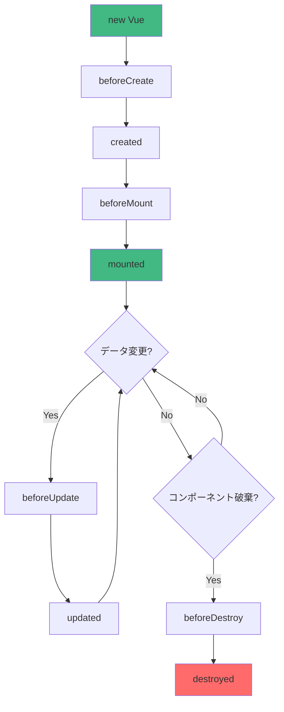
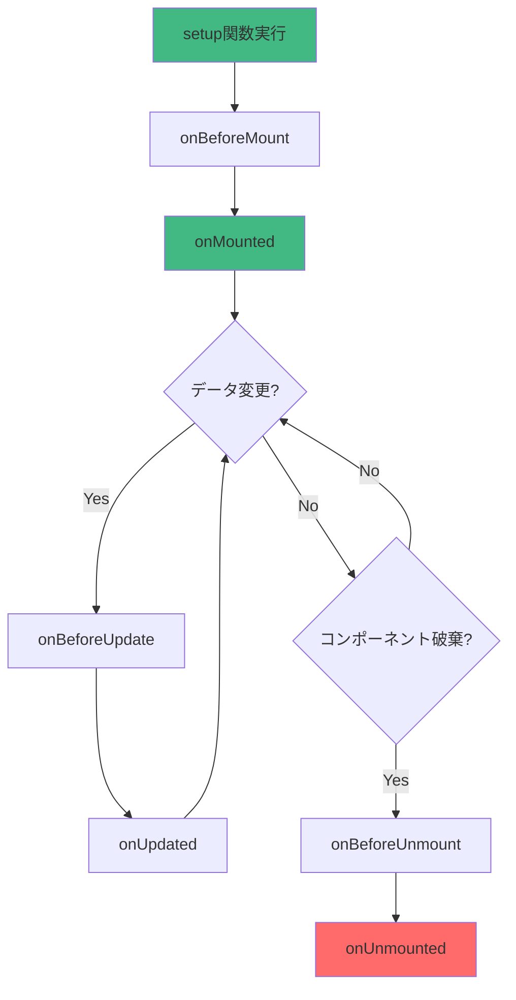
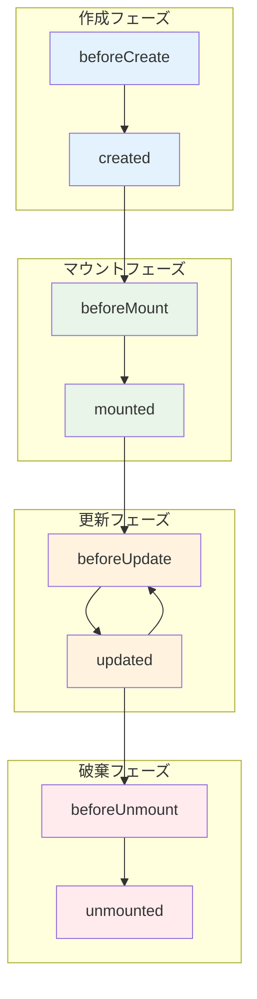

## ライフサイクルの歴史

Vue.jsのライフサイクルは、バージョンアップを重ねるごとに、より直感的で分かりやすく進化してきました。主な変遷はVue 1.xから2.x、そして2.xから3.x（特にComposition APIの導入）で見られます。

### Vue 1.x

Vueの初期バージョンである1.xでは、ライフサイクルフックは以下のような名前でした。今見ると少し分かりにくい部分もありますね。

  * `init`: インスタンスが作成された直後。
  * `created`: データ監視などが設定された後。
  * `beforeCompile`: テンプレートがコンパイルされる前。
  * `compiled`: テンプレートがコンパイルされた後。
  * `ready`: DOMにマウントされ、利用可能になった状態。Vue 2.xの `mounted` に相当します。
  * `beforeDestroy`: インスタンスが破棄される前。
  * `destroyed`: インスタンスが破棄された後。

この頃は、コンパイルの過程がライフサイクルフックとして公開されていました。

-----

### Vue 2.x

Vue 2.xでは、仮想DOM（Virtual DOM）が導入され、ライフサイクルフックが全面的に見直されました。これにより、より意味が分かりやすく、整理されたフックになりました。現在でも多くのプロジェクトで使われているおなじみのライフサイクルです。

  * **作成 (Creation)**
      * `beforeCreate`: インスタンスが初期化された直後。データやイベントはまだ設定されていません。
      * `created`: インスタンス作成完了。データ、算出プロパティ、メソッドなどが利用可能ですが、DOMへのマウントはまだです。
  * **マウント (Mounting)**
      * `beforeMount`: DOMにマウントが開始される直前。
      * `mounted`: インスタンスがDOMにマウントされた後。DOM要素へのアクセスが可能になります。
  * **更新 (Updating)**
      * `beforeUpdate`: データが変更され、DOMが再レンダリングされる前。
      * `updated`: データ変更によってDOMが更新された後。
  * **破棄 (Destruction)**
      * `beforeDestroy`: インスタンスが破棄される直前。
      * `destroyed`: インスタンスが破棄された後。イベントリスナーなどがすべて解除されます。

その他、`<keep-alive>`コンポーネントのための `activated` と `deactivated` も追加されました。

-----

### Vue 3.x

Vue 3では、従来のOptions APIに加えて、より柔軟なコード記述が可能になる**Composition API**が導入されました。これにより、ライフサイクルの扱い方も変わりました。

#### Options APIの変更点

従来のOptions APIも引き続き利用可能ですが、一部のフック名が変更され、より明確になりました。

  * `beforeDestroy` → `beforeUnmount`
  * `destroyed` → `unmounted`

これは、「破棄(Destroy)」よりも「マウント解除(Unmount)」という言葉の方が、DOMとの関連性をより正確に表しているためです。

#### Composition APIの導入

Composition APIでは、ライフサイクルフックを `setup` 関数内で関数として呼び出して使います。これにより、ロジックごとに関連するコードをまとめやすくなりました。

  * `setup` 関数は `beforeCreate` と `created` の役割を果たします。
  * `onBeforeMount`
  * `onMounted`
  * `onBeforeUpdate`
  * `onUpdated`
  * `onBeforeUnmount`
  * `onUnmounted`
  * `onErrorCaptured`
  * `onRenderTracked` / `onRenderTriggered` (デバッグ用)

<!-- end list -->

```javascript
import { onMounted, onUnmounted } from 'vue';

export default {
  setup() {
    onMounted(() => {
      console.log('コンポーネントがマウントされました！');
      // イベントリスナーの追加など
    });

    onUnmounted(() => {
      console.log('コンポーネントがアンマウントされます。');
      // クリーンアップ処理
    });
  }
}
```

このように、Vueのライフサイクルは、開発者がコンポーネントの状態をより正確に、そしてより整理された形で管理できるように進化してきました。

## ライフサイクルについて

ライフサイクルとは、ひと言でいうと**ものごとが生まれてから消えるまでの一連の流れ**のことです。ソフトウェア開発、特にVue.jsやReactのようなコンポーネントベースのフレームワークでよく使われる言葉です。

人間の人生に「誕生 → 成長 → 死」という流れがあるように、Webページの部品（コンポーネント）にも同様の流れがあります。

1.  **生成 (誕生)**: コンポーネントがメモリ上に作られ、画面に表示される。
2.  **更新 (成長)**: ユーザーの操作などでデータが変わり、表示がリアルタイムに更新される。
3.  **破棄 (死)**: ページ遷移などでコンポーネントが不要になり、画面から消されてメモリから解放される。

---

### なぜライフサイクルが重要なのか？ 🤔

この「流れ」の特定のタイミング（例えば「画面に表示された直後」や「消される直前」）を狙って、特定の処理を実行したい場面がよくあります。

そのタイミングを知らせてくれる合図が**ライフサイクルフック**です。

#### 具体的な例

* **「画面に表示された直後 (`mounted`)」**
    * サーバーから最新のデータを取ってきて表示したい 📈
    * アニメーションを開始したい ✨

* **「データが更新された直後 (`updated`)」**
    * 更新された情報に応じて、グラフを再描画したい 📊

* **「画面から消される直前 (`beforeUnmount`)」**
    * 動かしっぱなしだったタイマーを止めたい（メモリの無駄遣いを防ぐため）⏰
    * 「ページを離れますか？」という確認メッセージを出したい ⚠️

このように、ライフサイクルを理解することで、開発者は「この処理を、このタイミングで実行したい」ということを正確にコントロールできるようになります。

## Vue.jsライフサイクル図

### Vue 2.x ライフサイクル



### Vue 3.x Composition API ライフサイクル



### ライフサイクル比較表

```mermaid
graph LR
    subgraph "Vue 2.x"
        A1[beforeCreate] --> A2[created] --> A3[beforeMount] --> A4[mounted]
        A4 --> A5[beforeUpdate] --> A6[updated] --> A7[beforeDestroy] --> A8[destroyed]
    end
    
    subgraph "Vue 3.x Options API"
        B1[beforeCreate] --> B2[created] --> B3[beforeMount] --> B4[mounted]
        B4 --> B5[beforeUpdate] --> B6[updated] --> B7[beforeUnmount] --> B8[unmounted]
    end
    
    subgraph "Vue 3.x Composition API"
        C1[setup] --> C2[onBeforeMount] --> C3[onMounted]
        C3 --> C4[onBeforeUpdate] --> C5[onUpdated] --> C6[onBeforeUnmount] --> C7[onUnmounted]
    end
    
    style A1 fill:#e1f5fe
    style A2 fill:#e1f5fe
    style A3 fill:#e8f5e8
    style A4 fill:#e8f5e8
    style A5 fill:#fff3e0
    style A6 fill:#fff3e0
    style A7 fill:#ffebee
    style A8 fill:#ffebee
    
    style B1 fill:#e1f5fe
    style B2 fill:#e1f5fe
    style B3 fill:#e8f5e8
    style B4 fill:#e8f5e8
    style B5 fill:#fff3e0
    style B6 fill:#fff3e0
    style B7 fill:#ffebee
    style B8 fill:#ffebee
    
    style C1 fill:#e1f5fe
    style C2 fill:#e8f5e8
    style C3 fill:#e8f5e8
    style C4 fill:#fff3e0
    style C5 fill:#fff3e0
    style C6 fill:#ffebee
    style C7 fill:#ffebee
```



### ライフサイクルフェーズ別分類



Vueコンポーネントのライフサイクルを理解すると、「どの処理を・いつ実行するか」を自在にコントロールでき、よりクリーンで効率的なコードが書けるようになります。

ここでは、主要なライフサイクルフックの代表的な活用方法をフェーズごとに解説します。

-----

## ライフサイクルの活用方法

### 1\. 生成時 (`created` / `setup`) 🚀

コンポーネントがメモリ上に作成されたものの、まだ画面には表示されていないタイミングです。

  * **タイミング**: データ(`data`)やメソッド(`methods`)にはアクセスできますが、**DOM要素にはまだアクセスできません**。
  * **主な活用シーン**:
      * **API通信によるデータ初期化**: 画面表示に必要なデータをサーバーから取得します。DOMが不要なため、マウントを待つより早く処理を開始できます。
      * **propsを使ったデータの加工**: 親から渡された`props`を元に、コンポーネント内部で使うデータを準備します。

<!-- end list -->

```javascript
// Composition API (setup)
import { ref, onMounted } from 'vue';
import axios from 'axios';

const posts = ref([]);
// setup自体がcreatedの役割を果たすため、ここでAPIを呼ぶことも多い
axios.get('/api/posts').then(response => {
  posts.value = response.data;
});

// Options API (created)
export default {
  data() {
    return {
      posts: []
    };
  },
  created() {
    // createdフックでAPIを呼び出してデータをセット
    axios.get('/api/posts').then(response => {
      this.posts = response.data;
    });
  }
}
```

-----

### 2\. マウント時 (`mounted` / `onMounted`) 🔧

コンポーネントがHTMLとして画面に描画され、**DOMにアクセス可能になった**タイミングです。

  * **タイミング**: `this.$el`や`document.getElementById`などでDOM要素を直接操作できます。
  * **主な活用シーン**:
      * **DOM要素の直接操作**: 特定の要素にフォーカスを当てたり、要素の高さや幅を取得したりします。
      * **外部ライブラリの初期化**: グラフ描画(Chart.js)や地図表示(Google Maps)など、特定のDOM要素を必要とするライブラリをここで初期化します。
      * **イベントリスナーの登録**: `window`のスクロールやリサイズイベントなどを監視し始めます。

<!-- end list -->

```javascript
// Composition API (onMounted)
import { ref, onMounted } from 'vue';

const myElement = ref(null); // <div ref="myElement"></div> と紐づく

onMounted(() => {
  // DOM要素にアクセスして幅を取得
  console.log(myElement.value.offsetWidth);
  
  // windowにスクロールイベントを追加
  window.addEventListener('scroll', handleScroll);
});
```

-----

### 3\. 更新時 (`updated` / `onUpdated`) ✨

コンポーネント内のデータが変更され、画面の再描画が完了したタイミングです。

  * **タイミング**: 変更がDOMに反映された後。
  * **主な活用シーン**:
      * **DOM更新後の処理**: チャットアプリで新しいメッセージが追加された後、自動で一番下までスクロールさせたい場合などに使います。
  * **⚠️注意点**: このフック内でデータを変更すると、再描画が走り無限ループに陥る可能性があります。必ず`if`文などで更新条件を設ける必要があります。

<!-- end list -->

```javascript
// Composition API (onUpdated)
import { ref, onUpdated, nextTick } from 'vue';

const chatContainer = ref(null);

onUpdated(() => {
  // DOMが更新された後に実行
  // nextTickを使うとより確実
  nextTick(() => {
    chatContainer.value.scrollTop = chatContainer.value.scrollHeight;
  });
});
```

-----

### 4\. 破棄時 (`beforeUnmount` / `onUnmounted`) 🧹

コンポーネントが画面から取り除かれる直前のタイミングです。後片付け（クリーンアップ）に最適です。

  * **タイミング**: コンポーネントはまだ機能していますが、間もなく破棄されます。
  * **主な活用シーン（クリーンアップ処理）**:
      * **イベントリスナーの解除**: `mounted`で登録した`window`のイベントリスナーなどを解除します。これをしないと**メモリリーク**の原因になります。
      * **タイマーのクリア**: `setInterval`や`setTimeout`を停止します。
      * **外部ライブラリのインスタンス破棄**: `mounted`で生成したライブラリのインスタンスを破棄します。

<!-- end list -->

```javascript
// Composition API
import { onMounted, onUnmounted } from 'vue';

const handleScroll = () => { /* ... */ };

onMounted(() => {
  window.addEventListener('scroll', handleScroll);
});

onUnmounted(() => {
  // 必ずイベントリスナーを解除する
  console.log('クリーンアップします');
  window.removeEventListener('scroll', handleScroll);
});
```

### まとめ表

| フェーズ | フック名 (Options / Composition) | 主な活用シーン |
| :--- | :--- | :--- |
| **生成時** | `created` / `setup` | サーバーからのデータ取得、データの初期設定 |
| **マウント時** | `mounted` / `onMounted` | DOM操作、外部ライブラリの初期化、イベントリスナー登録 |
| **更新時** | `updated` / `onUpdated` | DOM更新後の処理（例: 自動スクロール） |
| **破棄時** | `beforeUnmount` / `onUnmounted` | イベントリスナー解除、タイマー停止などのクリーンアップ処理 |

これらのライフサイクルフックを適切に使い分けることで、コンポーネントの振る舞いを正確に管理し、バグの少ないアプリケーションを構築できます。