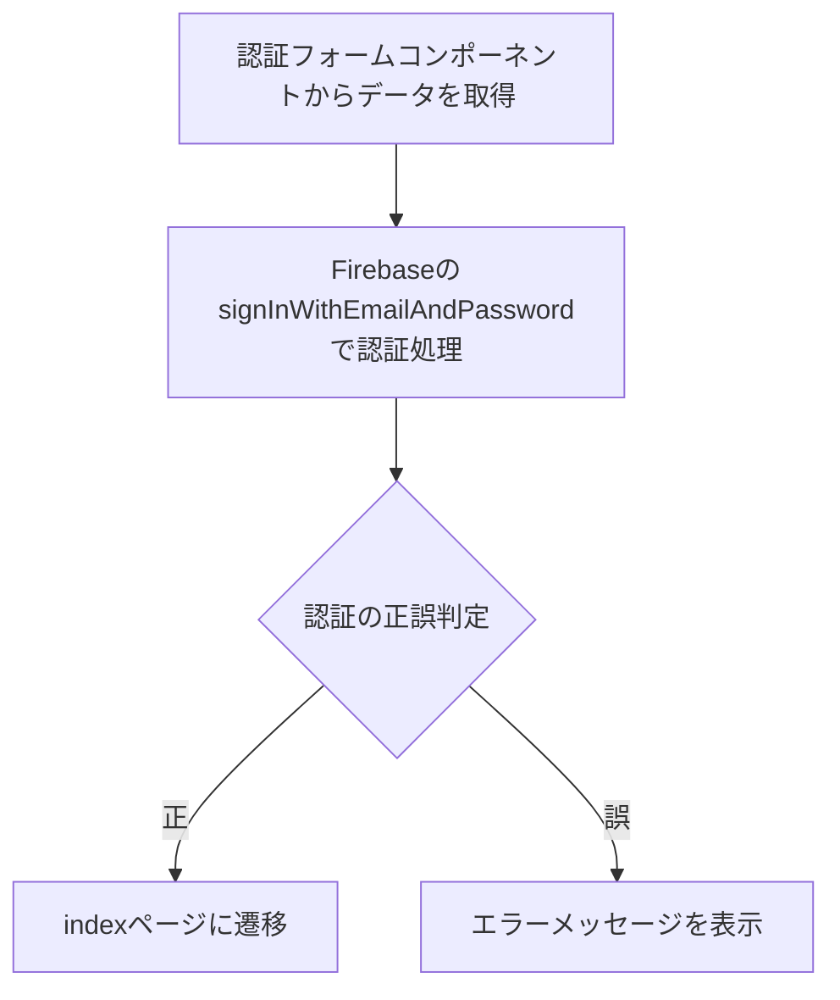

## まえおき
Firebaseの初期セットアップは済ませている事を前提に解説します。
必要ファイルが膨大に増えプロジェクトが複雑になるためエミュレータは使用しません。

## 画面レイアウト


- ログイン失敗時はFirebaseのエラーを直接表示する処理に一旦しておく
- 認証フォームコンポーネントを使用する

https://zenn.dev/shunsuke_stack/articles/3b7759f0053ca6

## 処理のフロー
- 認証フォームコンポーネントからデータを取得
- FirebaseのsignInWithEmailAndPassword()のメソッドで認証処理を行う
- 認証の正誤判定
    - 正：indexページに遷移する
    - 呉：エラーメッセージを表示する


## レイアウトの実装 Template
デザインはVuetifyを利用して作成
自作の”AuthForm”コンポーネントを利用

```vue
<template>
  <v-card class="mx-auto my-8" max-width="400">
    <v-card-item>
      <v-card-title> ログイン認証 </v-card-title>
      <v-card-subtitle>
        Firebaseによる”メールアドレス/パスワード”による認証
      </v-card-subtitle>
    </v-card-item>
    <v-card-item>
      <v-alert
        v-if="error"
        type="error"
        :text="error"
        variant="tonal"
      ></v-alert>
      <AuthForm class="my-4" btn-label="ログイン" @submit="loginSubmit" />
    </v-card-item>
  </v-card>
</template>
```

## 処理の実装 script

### app/pages/login.vueの実装
useAuth()はFiabaseの認証を行っているcomposables
結構シンプルにまとまったと感じている

```vue
<script setup lang="ts">
import AuthForm from '~/components/AuthForm.vue'

const { login } = useAuth()

const error = ref('')

const loginSubmit = async (data: { email: string; password: string }) => {
  error.value = ''
  const result = await login(data.email, data.password)

  if (result.error) {
    error.value = result.error.message
  } else {
    // ログイン成功時にindexページに遷移
    await navigateTo('/')
  }
}
</script>
```

### app/composables/useAuth.ts
signInWithEmailAndPassword()メソッドを活用してログイン処理を行い、
onAuthStateChangedの処理によってuser内に認証情報を格納しています。

```ts
import {
  signInWithEmailAndPassword,
  createUserWithEmailAndPassword,
  signOut,
  onAuthStateChanged,
  type User,
  type Auth,
} from 'firebase/auth'
import { useNuxtApp } from 'nuxt/app'

export const useAuth = () => {
  const { $auth } = useNuxtApp()
  const auth = $auth as Auth | null
  const user = ref<User | null>(null)
  const loading = ref(true)

  // 認証状態の監視
  onMounted(() => {
    if (!auth) {
      loading.value = false
      return
    }

    const unsubscribe = onAuthStateChanged(auth, (currentUser) => {
      console.log('currentUser', currentUser)
      user.value = currentUser
      loading.value = false
    })

    onUnmounted(() => unsubscribe())
  })

  // ログイン
  const login = async (email: string, password: string) => {
    if (!auth) {
      return {
        user: null,
        error: new Error('Firebase認証が初期化されていません'),
      }
    }
    try {
      const userCredential = await signInWithEmailAndPassword(
        auth,
        email,
        password
      )
      return { user: userCredential.user, error: null }
    } catch (error) {
      return { user: null, error: error as Error }
    }
  }

  return {
    user: readonly(user),
    loading: readonly(loading),
    login,
  }
}
```

## 認証状態の監視処理

```18:32:app/composables/useAuth.ts
// 認証状態の監視
onMounted(() => {
  if (!auth) {
    loading.value = false
    return
  }

  const unsubscribe = onAuthStateChanged(auth, (currentUser) => {
    console.log('currentUser', currentUser)
    user.value = currentUser
    loading.value = false
  })

  onUnmounted(() => unsubscribe())
})
```

### 処理の流れ：

1. **`onMounted()`**: Vueコンポーネントがマウントされた時に実行される

2. **認証オブジェクトの確認**: 
   - `if (!auth)` でFirebase認証オブジェクトが存在するかチェック
   - 存在しない場合は`loading.value = false`にして処理を終了

3. **認証状態の監視開始**:
   - `onAuthStateChanged(auth, callback)` でFirebaseの認証状態変化を監視
   - ユーザーのログイン/ログアウト状態が変化するたびにコールバックが実行される

4. **コールバック処理**:
   - `currentUser` パラメータで現在のユーザー情報を受け取る
   - `user.value = currentUser` でリアクティブなユーザー状態を更新
   - `loading.value = false` でローディング状態を解除

5. **クリーンアップ処理**:
   - `onUnmounted()` でコンポーネントがアンマウントされる時に
   - `unsubscribe()` を呼び出して認証状態の監視を停止

### 重要なポイント：

- **リアクティブ性**: `user`と`loading`は`ref()`で作成されたリアクティブな変数
- **メモリリーク防止**: コンポーネントのアンマウント時に監視を停止
- **初期状態管理**: ローディング状態で初期化し、認証状態が確定したら解除

この処理により、アプリケーション全体でユーザーの認証状態をリアルタイムで監視し、UIに反映することができます。

**`onMounted()`**: Vueコンポーネントがマウントされた時に実行される処理（ライフサイクル）がcomposablesで行えるのが今回の学びでした

## Github コミット
https://github.com/nakajima-sh-cnctor/nuxt4-firebase-chat/commit/ac07815322a5c1fc21fa6f27de2d63e8097b2ad8