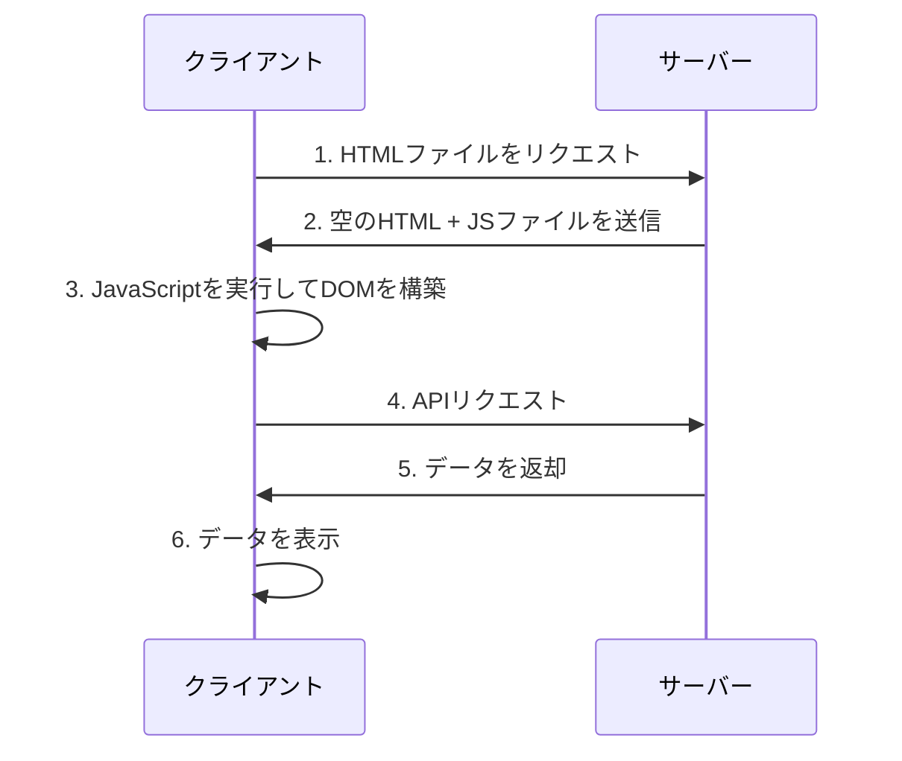
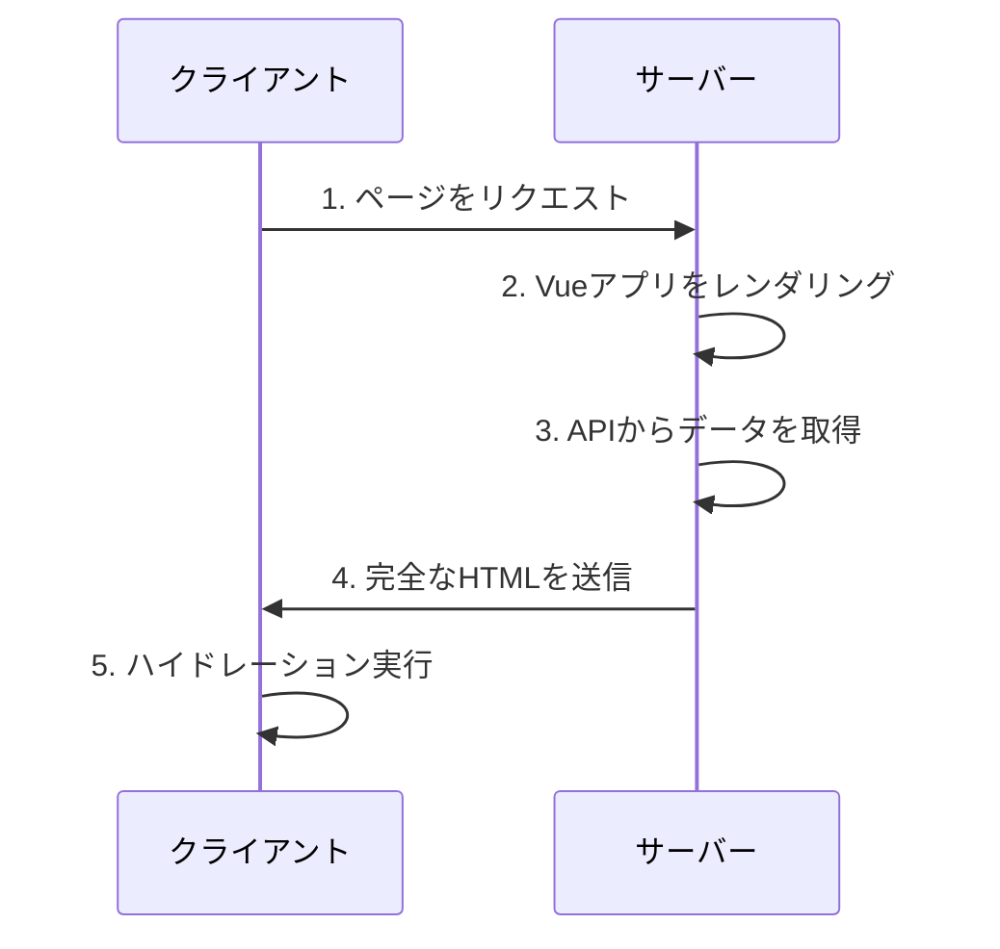
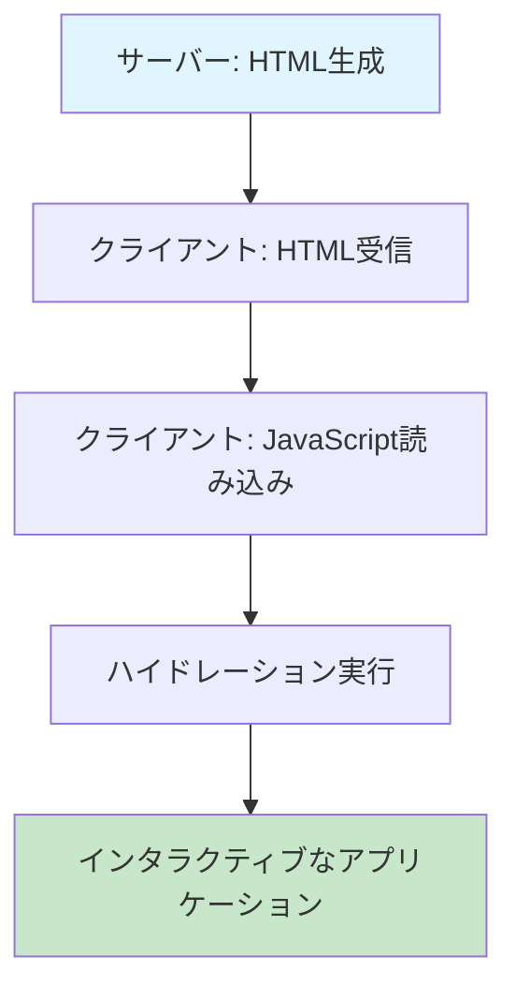

# Vue3のサーバーサイドレンダリング（SSR）ガイド

Vue3のサーバーサイドレンダリング（SSR）について、基本概念から実装まで詳しく解説します。Nuxt3を使った実践的なアプローチも含めて、SSRのメリットと実装方法を学びました。

## サーバーサイドレンダリング（SSR）とは

サーバーサイドレンダリング（SSR）は、Webページをサーバー側で事前にレンダリングして、完全なHTMLをクライアントに送信する技術です。従来のクライアントサイドレンダリング（CSR）とは異なり、初回表示が高速で、SEOにも優れています。

### SSRとCSRの違い

#### クライアントサイドレンダリング（CSR）


#### サーバーサイドレンダリング（SSR）


### SSRのメリット

- **初期表示の高速化**: 完全なHTMLが送信されるため、初回表示が早い
- **SEO対応**: 検索エンジンがコンテンツを正しく認識できる
- **パフォーマンス向上**: Core Web Vitalsの改善
- **アクセシビリティ**: スクリーンリーダーなどの支援技術との互換性
- **ソーシャルメディア対応**: OGPタグが正しく認識される

### SSRのデメリットと注意点

- **サーバー負荷の増加**: 各リクエストでサーバー側でレンダリングが必要
- **複雑性の増加**: サーバーとクライアントの両方で動作するコードが必要
- **ハイドレーションの注意**: サーバーとクライアントで異なる結果が生成される可能性
- **キャッシュ戦略の重要性**: 適切なキャッシュ設定がパフォーマンスに大きく影響

## Vue3でのSSRの基本概念

Vue3では、`createSSRApp`を使用してSSRアプリケーションを作成します。基本的な流れは以下の通りです：

1. サーバー側でVueアプリケーションをレンダリング
2. 生成されたHTMLをクライアントに送信
3. クライアント側でハイドレーション（hydration）を実行

### ハイドレーション（Hydration）とは

ハイドレーションは、サーバー側で生成された静的なHTMLに、クライアント側でVueアプリケーションの状態とイベントリスナーを「注水」するプロセスです。



#### ハイドレーションの詳細プロセス

1. **サーバー側レンダリング**: VueコンポーネントをHTML文字列に変換
2. **HTML送信**: 完全なHTMLをクライアントに送信
3. **JavaScript読み込み**: VueアプリケーションのJavaScriptを読み込み
4. **DOM比較**: サーバー側のHTMLとクライアント側の仮想DOMを比較
5. **イベントリスナー追加**: 必要なイベントリスナーをDOMに追加
6. **状態復元**: アプリケーションの状態を復元

### 基本的なSSRの実装

#### サーバー側の実装

```javascript
// server.js
import { createSSRApp } from 'vue'
import { renderToString } from 'vue/server-renderer'
import App from './App.vue'

// サーバー側でVueアプリケーションを作成
const app = createSSRApp(App)

// HTML文字列にレンダリング
const html = await renderToString(app)

// 完全なHTMLページを生成
const fullHtml = `
<!DOCTYPE html>
<html>
<head>
  <title>Vue3 SSR App</title>
</head>
<body>
  <div id="app">${html}</div>
  <script type="module" src="/client.js"></script>
</body>
</html>
`

// HTMLをクライアントに送信
res.send(fullHtml)
```

#### クライアント側の実装

```javascript
// client.js
import { createSSRApp } from 'vue'
import App from './App.vue'

// クライアント側でVueアプリケーションを作成
const app = createSSRApp(App)

// ハイドレーションを実行
app.mount('#app')
```

### ハイドレーションの注意点

#### 1. サーバーとクライアントの一貫性

```vue
<!-- ❌ 問題のあるコード -->
<template>
  <div>
    <p>現在時刻: {{ new Date().toLocaleString() }}</p>
  </div>
</template>

<!-- ✅ 修正されたコード -->
<template>
  <div>
    <p>現在時刻: {{ formattedTime }}</p>
  </div>
</template>

<script setup>
// サーバーとクライアントで一貫した結果を保証
const formattedTime = new Date().toLocaleString('ja-JP', {
  timeZone: 'Asia/Tokyo'
})
</script>
```

#### 2. ブラウザ専用APIの使用

```vue
<template>
  <div>
    <p v-if="isClient">ブラウザでのみ表示</p>
  </div>
</template>

<script setup>
import { ref, onMounted } from 'vue'

const isClient = ref(false)

onMounted(() => {
  isClient.value = true
})
</script>
```

## Nuxt3を使ったSSR実装

Nuxt3は、Vue3のSSRを簡単に実装できるフレームワークです。設定が少なく、多くの機能が標準で提供されています。

### プロジェクトの作成

```bash
npx nuxi@latest init my-ssr-app
cd my-ssr-app
npm install
```

### 基本的なページ構造

```vue
<!-- pages/index.vue -->
<template>
  <div>
    <h1>{{ title }}</h1>
    <p>{{ description }}</p>
  </div>
</template>

<script setup>
const title = 'Vue3 SSR アプリケーション'
const description = 'Nuxt3を使ったSSRの実装例です'
</script>
```

### データフェッチング

Nuxt3では、`useFetch`や`useAsyncData`を使用してサーバー側でデータを取得できます：

```vue
<!-- pages/posts.vue -->
<template>
  <div>
    <h1>投稿一覧</h1>
    <!-- ローディング状態の表示 -->
    <div v-if="pending" class="loading">
      読み込み中...
    </div>
    <!-- エラー状態の表示 -->
    <div v-else-if="error" class="error">
      エラーが発生しました: {{ error }}
    </div>
    <!-- データの表示 -->
    <ul v-else>
      <li v-for="post in posts" :key="post.id">
        <h3>{{ post.title }}</h3>
        <p>{{ post.excerpt }}</p>
        <span>{{ formatDate(post.createdAt) }}</span>
      </li>
    </ul>
  </div>
</template>

<script setup>
// サーバー側でデータを取得
const { data: posts, pending, error } = await useFetch('/api/posts', {
  // キャッシュキーを指定（同じキーで複数回呼び出されても1回だけ実行）
  key: 'posts',
  
  // デフォルト値を設定
  default: () => [],
  
  // データの変換処理
  transform: (data) => {
    return data.map(post => ({
      ...post,
      // 日付のフォーマット
      createdAt: new Date(post.createdAt)
    }))
  },
  
  // サーバー側でのみ実行（クライアント側ではキャッシュを使用）
  server: true,
  
  // クライアント側での再取得を無効化
  client: false
})

// 日付フォーマット関数
const formatDate = (date) => {
  return new Intl.DateTimeFormat('ja-JP', {
    year: 'numeric',
    month: 'long',
    day: 'numeric'
  }).format(date)
}
</script>
```

## パフォーマンス最適化

### 1. コード分割

```javascript
// nuxt.config.ts
export default defineNuxtConfig({
  experimental: {
    payloadExtraction: false
  },
  nitro: {
    experimental: {
      wasm: true
    }
  }
})
```

### 2. キャッシュ戦略

```vue
<!-- components/ProductList.vue -->
<template>
  <div>
    <!-- ローディング状態 -->
    <div v-if="pending" class="loading">
      <div class="skeleton" v-for="i in 6" :key="i"></div>
    </div>
    
    <!-- エラー状態 -->
    <div v-else-if="error" class="error">
      <p>商品の読み込みに失敗しました</p>
      <button @click="refresh()">再試行</button>
    </div>
    
    <!-- 商品一覧 -->
    <div v-else class="product-grid">
      <ProductCard 
        v-for="product in products" 
        :key="product.id" 
        :product="product" 
      />
    </div>
  </div>
</template>

<script setup>
// キャッシュを活用したデータ取得
const { data: products, pending, error, refresh } = await useFetch('/api/products', {
  // キャッシュキー（同じキーで複数回呼び出されても1回だけ実行）
  key: 'products',
  
  // デフォルト値
  default: () => [],
  
  // データの変換処理
  transform: (data) => data.products,
  
  // カスタムキャッシュ戦略
  getCachedData: (key) => {
    // サーバー側のキャッシュを確認
    if (process.server) {
      return nuxtApp.ssrContext?.cache?.[key]
    }
    // クライアント側のペイロードを確認
    return nuxtApp.payload.data[key]
  },
  
  // キャッシュの有効期限（秒）
  maxAge: 60 * 5, // 5分
  
  // サーバー側でのみ実行
  server: true,
  
  // クライアント側での再取得を無効化
  client: false
})

// 手動でのリフレッシュ
const refreshProducts = async () => {
  await refresh()
}
</script>

<style scoped>
.loading {
  display: grid;
  grid-template-columns: repeat(auto-fill, minmax(250px, 1fr));
  gap: 1rem;
}

.skeleton {
  height: 300px;
  background: linear-gradient(90deg, #f0f0f0 25%, #e0e0e0 50%, #f0f0f0 75%);
  background-size: 200% 100%;
  animation: loading 1.5s infinite;
}

@keyframes loading {
  0% { background-position: 200% 0; }
  100% { background-position: -200% 0; }
}

.product-grid {
  display: grid;
  grid-template-columns: repeat(auto-fill, minmax(250px, 1fr));
  gap: 1rem;
}
</style>
```

### 3. 画像最適化

```vue
<template>
  <div>
    <!-- Nuxt Imageを使用した最適化 -->
    <NuxtImg 
      src="/images/hero.jpg" 
      alt="ヒーロー画像"
      width="800"
      height="400"
      loading="lazy"
    />
  </div>
</template>
```

## デプロイメント

### Vercelでのデプロイ

```json
// vercel.json
{
  "builds": [
    {
      "src": "package.json",
      "use": "@vercel/node"
    }
  ]
}
```

### Dockerでのデプロイ

```dockerfile
# Dockerfile
FROM node:18-alpine

WORKDIR /app

COPY package*.json ./
RUN npm ci --only=production

COPY . .
RUN npm run build

EXPOSE 3000

CMD ["npm", "start"]
```

## ベストプラクティス

### 1. SEO対策

```vue
<!-- pages/blog/[slug].vue -->
<script setup>
const route = useRoute()
const { data: post } = await useFetch(`/api/posts/${route.params.slug}`)

// SEOメタデータの設定
useSeoMeta({
  title: post.value?.title,
  description: post.value?.excerpt,
  ogTitle: post.value?.title,
  ogDescription: post.value?.excerpt,
  ogImage: post.value?.image,
  twitterCard: 'summary_large_image'
})
</script>
```

### 2. エラーハンドリング

```vue
<!-- error.vue -->
<template>
  <div class="error-page">
    <h1>{{ error.statusCode }}</h1>
    <p>{{ error.statusMessage }}</p>
    <button @click="handleError">再試行</button>
  </div>
</template>

<script setup>
const props = defineProps(['error'])

const handleError = () => clearError({ redirect: '/' })
</script>
```

### 3. パフォーマンス監視

```javascript
// plugins/performance.client.js
export default defineNuxtPlugin(() => {
  if (process.client) {
    // Core Web Vitalsの監視
    import('web-vitals').then(({ getCLS, getFID, getFCP, getLCP, getTTFB }) => {
      getCLS(console.log)
      getFID(console.log)
      getFCP(console.log)
      getLCP(console.log)
      getTTFB(console.log)
    })
  }
})
```

## トラブルシューティング

### よくある問題と解決方法

#### 1. ハイドレーションエラー

**問題**: サーバーとクライアントで異なるHTMLが生成される

```javascript
// ❌ 問題のあるコード
const randomValue = Math.random()

// ✅ 解決方法
const randomValue = ref(0)
onMounted(() => {
  randomValue.value = Math.random()
})
```

#### 2. メモリリーク

**問題**: サーバー側でメモリが適切に解放されない

```javascript
// server.js
const renderApp = async (url) => {
  const app = createSSRApp(App)
  const html = await renderToString(app)
  
  // アプリケーションインスタンスを適切に破棄
  app.unmount()
  
  return html
}
```

#### 3. 非同期データの取得

**問題**: サーバー側でデータが取得できない

```vue
<!-- pages/posts.vue -->
<script setup>
// ✅ 正しい非同期データの取得
const { data: posts, error } = await useFetch('/api/posts', {
  server: true, // サーバー側で実行
  default: () => []
})

if (error.value) {
  throw createError({
    statusCode: 404,
    statusMessage: 'Posts not found'
  })
}
</script>
```

#### 4. 環境変数の問題

**問題**: サーバーとクライアントで環境変数が異なる

```javascript
// nuxt.config.ts
export default defineNuxtConfig({
  runtimeConfig: {
    // サーバー側でのみ利用可能
    apiSecret: process.env.API_SECRET,
    
    // クライアント側でも利用可能
    public: {
      apiBase: process.env.NUXT_PUBLIC_API_BASE
    }
  }
})
```

### デバッグのコツ

#### 1. サーバー側のログ

```javascript
// plugins/debug.server.js
export default defineNuxtPlugin(() => {
  console.log('Server-side rendering:', process.server)
  console.log('Current URL:', useRequestURL())
})
```

#### 2. クライアント側のログ

```javascript
// plugins/debug.client.js
export default defineNuxtPlugin(() => {
  console.log('Client-side hydration:', process.client)
  console.log('Window object available:', typeof window !== 'undefined')
})
```

#### 3. パフォーマンス監視

```javascript
// plugins/performance.js
export default defineNuxtPlugin(() => {
  if (process.client) {
    // ハイドレーション時間の測定
    const startTime = performance.now()
    
    nextTick(() => {
      const endTime = performance.now()
      console.log(`Hydration time: ${endTime - startTime}ms`)
    })
  }
})
```

## まとめ

Vue3のSSRは、パフォーマンスとSEOの両方を向上させる強力な技術です。Nuxt3を使用することで、複雑な設定なしにSSRアプリケーションを構築できます。

### 重要なポイント

- **初期表示の高速化とSEO対応**: 完全なHTMLを送信することで、検索エンジンとユーザーの両方に優しい
- **Nuxt3を使った簡単な実装**: フレームワークの力を活用して開発効率を向上
- **パフォーマンス最適化のテクニック**: キャッシュ戦略、コード分割、画像最適化
- **適切なデプロイメント戦略**: 本番環境での安定した運用
- **トラブルシューティング**: よくある問題とその解決方法

### 次のステップ

1. **プロジェクトの作成**: Nuxt3で新しいプロジェクトを開始
2. **段階的な実装**: まずは基本的なSSRから始める
3. **パフォーマンス測定**: Core Web Vitalsを監視
4. **最適化の適用**: 必要に応じてキャッシュやコード分割を実装

SSRを活用して、より良いユーザー体験を提供するアプリケーションを構築しましょう！
